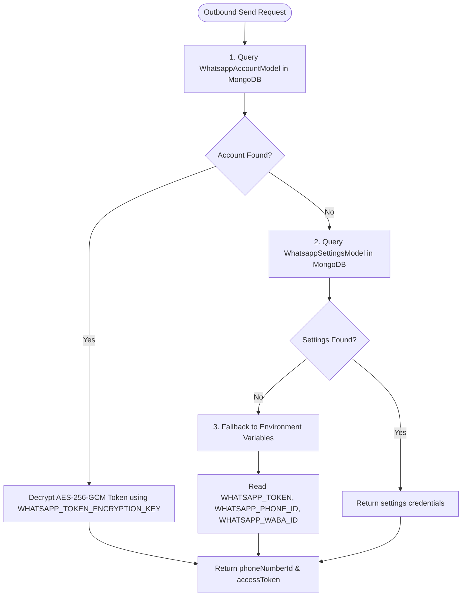
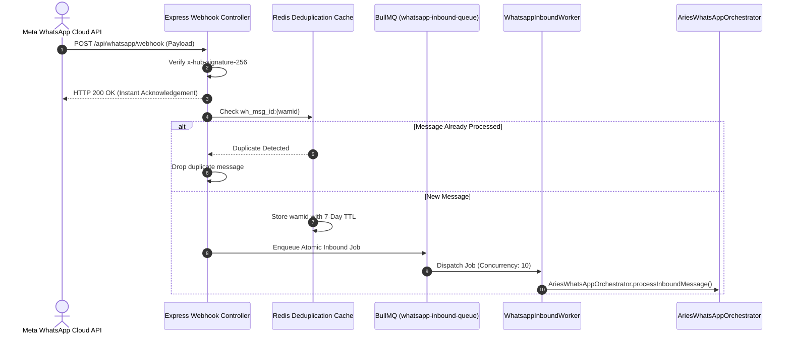

# DEEP DIVE 01: ARCHITECTURE, PROVIDERS & WEBHOOK INGRESS

## 1. Meta WhatsApp Cloud API Integration

### Core Transport Layer
The Aries HealthCare ecosystem connects **directly to Meta's WhatsApp Cloud API (Graph API v21.0)**. The primary interface resides in:
* **Service File:** `ariesxpert-backend/src/adminModule/whatsapp/whatsapp.service.ts` (`WhatsappService`)
* **OS Gateway File:** `ariesxpert-backend/src/modules/whatsapp-os/services/whatsapp-gateway.service.ts` (`WhatsappGatewayService`)

### Outbound Message Dispatch
Outbound communication is performed via HTTP `POST` requests to:
```
https://graph.facebook.com/v21.0/${phoneNumberId}/messages
```
Payloads are authenticated using a Bearer token:
```
Authorization: Bearer ${accessToken}
Content-Type: application/json
```

### Multi-WABA & Multi-Account Credential Resolution
The platform supports multiple WhatsApp Business Accounts (WABAs) across branches, clinics, or countries via a resilient 3-tier lookup hierarchy:



---

## 2. BotBee Forensic Investigation

A forensic audit of the entire codebase was conducted to determine if BotBee is utilized.

* **Search Term:** `BotBee`, `botbee`, `BOTBEE`
* **Occurrences in Code:** Exactly **one (1)** instance.
* **Exact File:** `AriesXpert-Admin-Dashboard/src/components/whatsapp/FlowBuilder/FlowBuilder.tsx` (Line 399):
```typescript
// 2. PURE SMOOTH WHITE CANVAS (NO DOTS, BOTBEE UX)
```
* **Analysis:** This occurrence is an internal developer comment referencing the visual styling and aesthetic design of BotBee's UI canvas when building the custom ReactFlow node editor in the Admin Dashboard.
* **Conclusion:** There are **no API connections, no webhooks, no SDKs, and no credentials for BotBee** anywhere in the runtime or backend code. Aries HealthCare uses Meta Cloud API exclusively.

---

## 3. Webhook Ingress Architecture & Security

### Entry Points
Inbound webhooks from Meta's servers arrive at:
* `GET /api/whatsapp/webhook` (Handshake verification)
* `POST /api/whatsapp/webhook` (Message & status event delivery)
* Aliases: `/api/v1/whatsapp/webhook`, `/api/admin/whatsapp/webhook`
* **Controller:** `ariesxpert-backend/src/adminModule/whatsapp/whatsapp.controller.ts` (`WhatsappController`)

### Webhook Verification Handshake (GET)
When configuring the webhook in the Meta App Developer Portal, Meta issues a `GET` request with challenge parameters:
```typescript
const mode = req.query['hub.mode'];
const token = req.query['hub.verify_token'];
const challenge = req.query['hub.challenge'];

if (mode === 'subscribe' && crypto.timingSafeEqual(
    Buffer.from(token as string),
    Buffer.from(configuredVerifyToken)
)) {
    return res.status(200).send(challenge);
}
```
* **Security:** Employs constant-time buffer comparison (`crypto.timingSafeEqual`) to prevent timing attacks.

### Webhook Signature Authentication (POST)
For every incoming POST payload, Meta signs the body using HMAC-SHA256 with the application secret:
```typescript
const signature = req.headers['x-hub-signature-256'] as string;
const rawBody = req.rawBody; // Captured in src/index.ts before JSON parsing
const expectedSignature = 'sha256=' + crypto.createHmac('sha256', META_APP_SECRET).update(rawBody).digest('hex');

if (!crypto.timingSafeEqual(Buffer.from(signature), Buffer.from(expectedSignature))) {
    return res.status(401).send('Invalid webhook signature');
}
```
* **Raw Body Preservation:** Configured in `src/index.ts` (lines 283–291) to guarantee byte-for-byte HMAC verification fidelity.

---

## 4. Message Queuing, Deduplication & Worker Pipeline



### Redis Fallback
If the Redis cluster is unreachable or disconnected:
* `WhatsappQueueService` transparently falls back to `setImmediate` local in-process asynchronous dispatch.
* Ensures zero dropped messages during transient Redis maintenance or network partitions.
