# DEEP DIVE 03: CONVERSATION STATE, TEMPLATES & FLOWS AUDIT

## 1. Conversation State Management & Session Lifecycle

### State Persistence Model
Multi-step conversational state is stored in MongoDB using `WhatsappConversationModel` (`src/adminModule/whatsapp/whatsapp-conversation.model.ts`):

```typescript
export interface IWhatsappConversation {
  wabaId?: string;
  phoneNumberId?: string;
  contactPhone: string;
  contactName?: string;
  contactType?: 'patient' | 'therapist' | 'doctor' | 'lead' | 'admin' | 'unknown';
  assignedUserId?: string;
  status: 'open' | 'closed' | 'snoozed';
  isHumanTakeover: boolean;
  takeoverExpiresAt?: Date;
  unreadCount: number;
  lastMessageText?: string;
  lastMessageAt?: Date;
  metadata?: {
    step?: string;
    triageCondition?: string;
    selectedService?: string;
    selectedCity?: string;
    selectedDate?: string;
    selectedSlot?: string;
    context?: Record<string, any>;
  };
}
```

### Session Durability & 24-Hour Messaging Window
1. **Server Restarts & Deployments:** Because conversation step, active intent, and user profile are saved in MongoDB (backed by Redis cache), state **fully survives server restarts, application crashes, and cluster redeployments**.
2. **Meta 24-Hour Customer Service Window:**
   - Meta limits freeform text messaging to 24 hours from the user's last inbound message.
   - When a cron job or worker attempts to contact a patient after 24 hours have elapsed, Meta's API returns error `131047: Re-engagement message required`.
   - `WhatsappService` intercepts this error and automatically falls back to an approved Meta Template (`care_appointment_reminder_v1`).

---

## 2. WhatsApp Interactive Elements Support Matrix

| Interactive Element | Meta Specification | Supported in Code? | Implementation Method / Class |
| :--- | :--- | :---: | :--- |
| **Normal Text** | Up to 4,096 characters | ✅ YES | `WhatsappService.sendMessage` |
| **Formatted Text** | Bold (`*`), Italic (`_`), Code (`` ` ``) | ✅ YES | String markdown formatters |
| **Quick Reply Buttons** | Up to 3 buttons per message | ✅ YES | `WhatsappService.sendInteractiveButtons` |
| **Interactive List** | Up to 10 rows in sections | ✅ YES | `WhatsappService.sendInteractiveList` |
| **CTA URL Buttons** | External web redirect links | ✅ YES | Configured inside template payloads |
| **Phone Call Buttons** | Native dialer trigger | ✅ YES | Template button component type: `PHONE_NUMBER` |
| **Images** | JPEG / PNG up to 5 MB | ✅ YES | `WhatsappService.sendMediaMessage` (type: `'image'`) |
| **PDF Documents** | PDF up to 100 MB | ✅ YES | `WhatsappService.sendMediaMessage` (type: `'document'`) |
| **Audio / Voice Notes** | OGG with Opus codec up to 16 MB | 🟡 PARTIAL | Outbound send supported; inbound transcription unbuilt |
| **Videos** | MP4 up to 16 MB | 🟡 PARTIAL | Supported via API payload; no automated generation |
| **Meta Native Flows** | In-app native form rendering | ⚪ NO | **Not Implemented** (Zero Meta Flow JSON schemas) |
| **Native Carousels** | Up to 10 swipeable cards | ⚪ NO | **Not Implemented** |
| **In-Chat Payments** | Meta UPI / Cards checkout | ⚪ NO | **Not Implemented** (Uses external Razorpay links) |

---

## 3. WhatsApp Template Inventory & Audit

### Master Catalog Analysis
* **Catalog File:** `src/data/whatsapp_master_templates_770.json`
* **Seeding Script:** `scripts/seed-whatsapp-master-templates.ts`
* **Database Model:** `WhatsappTemplateModel` (`src/adminModule/whatsapp/whatsapp-template.model.ts`)

#### Catalog Statistics:
```
Total Templates Seeded:       770
Categories Represented:       17 Specialty Areas
Header Formats:
  - TEXT Header:              401 (52.1%)
  - IMAGE Header:             341 (44.3%)
  - NONE (No Header):         28  (3.6%)
Interactive Elements:
  - QUICK_REPLY Buttons:      1,581 buttons across templates
  - URL Buttons:              2 buttons
```

### The Disconnect: Code Utilization vs. Catalog Reality
A forensic review of all backend controllers, services, and background workers reveals a dramatic divergence between what is defined in the database and what is actually invoked by executable code:

* **Templates Stored in Database / Catalog:** 770
* **Templates Actively Dispatched by Backend Logic:** **Exactly One (1)**:
  - **`care_appointment_reminder_v1`**
  - **Invoked in:** `src/adminModule/whatsapp/whatsapp.service.ts`
  - **Trigger:** Dispatched as the automated fallback when the 24-hour customer care messaging window has expired during scheduled appointment reminder jobs.
* **Status of the Remaining 769 Templates:**
  - They are stored in MongoDB to support manual broadcast campaigns created via the Admin Dashboard (`src/adminModule/whatsapp/whatsapp-campaign.model.ts`).
  - They are **not hardwired to any automated backend events, CRM triggers, or booking actions**.

---

## 4. WhatsApp Flows: The Truth

### Meta Native Flows vs. Internal Canvas Flow Builder
A critical source of potential confusion in the project is the use of the term "Flow":

```mermaid
graph TD
    subgraph Meta_Native_Flows["Meta Native WhatsApp Flows (CLIENT-SIDE)"]
        MF1["Native In-App WhatsApp Screen"] --> MF2["Flow JSON Schema (Screens, Dropdowns, Date Pickers)"]
        MF2 --> MF3["Flow Completion Callback (nfm_reply / flow_token)"]
        MF3 --> MF4["Server Endpoint with AES-GCM Payload Decryption"]
    end
    
    subgraph Internal_Canvas_Flows["Aries Internal Visual Graph Engine (SERVER-SIDE)"]
        IF1["Admin Dashboard ReactFlow Canvas"] --> IF2["WhatsappFlowModel (JSON Node Graph)"]
        IF2 --> IF3["WhatsappHTTPRunnerService.executeFlow()"]
        IF3 --> IF4["Executes Server-Side HTTP Requests & Template Sends"]
    end
```



### Forensic Verdict:
1. **Meta Native WhatsApp Flows:** **ZERO IMPLEMENTATION**.
   - There are no Meta Flow JSON definitions in the codebase.
   - There is no Flow data exchange endpoint (`/api/whatsapp/flow-data`).
   - There is no cryptographic private key or AES-GCM decryption engine to parse native flow submissions.
2. **Internal Canvas Flows:** **111 Visual Workflows Implemented**.
   - Located in `src/data/whatsapp/master-catalog.ts` (`MASTER_ARIES_110_FLOWS`).
   - Stored in MongoDB `WhatsappFlowModel`.
   - Executed by `WhatsappHTTPRunnerService` (`src/adminModule/whatsapp/whatsapp-flow-runner.service.ts`).
   - Used for internal campaign automation, **not client-side native WhatsApp forms**.
