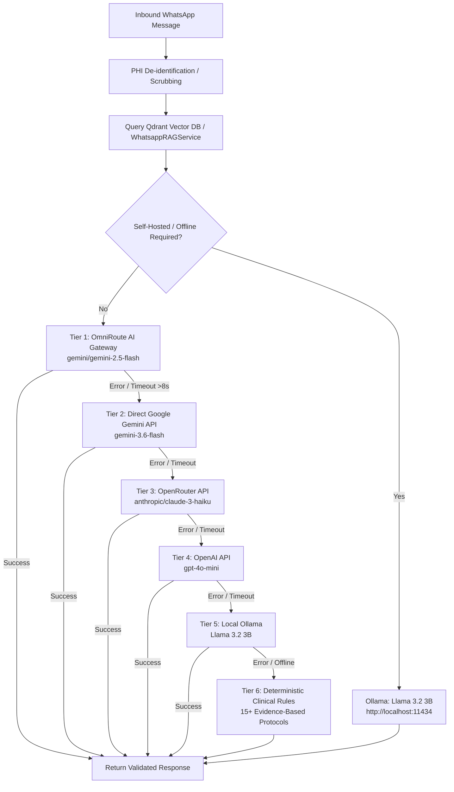

# DEEP DIVE 04: AI ORCHESTRATION, LLM ROUTING & CLINICAL PROTOCOLS

## 1. The Central AI Orchestrator Architecture

The conversational intelligence of the WhatsApp ecosystem is powered by **`AIOrchestrator`** (`ariesxpert-backend/src/aiModule/ai.orchestration.ts`). It governs all automated clinical inquiries, symptom analysis, and natural language triage through an intelligent multi-tiered cascading fallback mechanism.

---

## 2. LLM Provider Specifications & Execution Tracing

| Tier Level | Provider Name | Model Identifier | Implementation Method | Environment Variables | Target Purpose |
| :---: | :--- | :--- | :--- | :--- | :--- |
| **1** | **OmniRoute** | `gemini/gemini-2.5-flash` | `callOmniRoute` in `ai.orchestration.ts` | `OMNIROUTE_BASE_URL` / `OMNIROUTE_API_URL` | Primary low-latency cloud gateway |
| **2** | **Google Gemini** | `gemini-3.6-flash` | `callGemini` via Generative Language API | `GEMINI_API_KEY` | Direct clinical reasoning & triage |
| **3** | **OpenRouter** | `anthropic/claude-3-haiku` | `callOpenRouter` / `aiWhatsapp.service.ts` | `OPENROUTER_API_KEY` | Conversational empathy & complex triage |
| **4** | **OpenAI** | `gpt-4o-mini` | `callChatGPT` in `ai.orchestration.ts` | `OPENAI_API_KEY` | High-availability cloud backup |
| **5** | **Ollama** | `llama3.2:3b` | `callOllama` in `ai.orchestration.ts` | `OLLAMA_URL` (default: localhost:11434) | Zero-cost offline on-prem execution |
| **6** | **Deterministic**| Hardcoded Protocol Engine | `getLocalClinicalResponse` | N/A (Embedded TypeScript) | Zero-dependency clinical safety fallback |

---

## 3. The 15 Evidence-Based Clinical Fallback Protocols

When cloud networks are partitioned or all LLM API quotas are exhausted, `getLocalClinicalResponse` evaluates the inbound text against a pre-compiled clinical rules engine. These protocols were drafted according to evidence-based physiotherapy guidelines:

1. **Anterior Cruciate Ligament (ACL) Tears:** Recommends immediate R.I.C.E. protocol, range-of-motion assessment, quad activation, and surgical pre-hab/post-hab guidance.
2. **Meniscus Tears:** Advises on joint-line tenderness, avoiding deep squats, gentle non-weight-bearing cycling, and specialist evaluation.
3. **Rotator Cuff Tendinopathy:** Details subacromial decompression guidelines, pendulum exercises, scapular stabilization, and overhead reaching restrictions.
4. **Knee Osteoarthritis:** Outlines quad strengthening (isometric vastus medialis), low-impact hydrotherapy/walking, and joint preservation.
5. **Lumbar Sciatica & Disc Herniation:** Highlights McKenzie extension exercises, core spinal stabilization, posture correction, and cauda equina red flags.
6. **Frozen Shoulder (Adhesive Capsulitis):** Maps 3-phase progression (freezing, frozen, thawing), gentle capsule stretching, and sleep ergonomics.
7. **Cervical Spondylosis & Neck Pain:** Deep neck flexor training, thoracic mobility exercises, ergonomic desk setup, and chin tucks.
8. **Plantar Fasciitis:** Calf and plantar fascia stretching, arch support advice, frozen can rolling, and first-step morning pain mitigation.
9. **Tennis / Golfer's Elbow:** Eccentric wrist extensor loading, forearm strap positioning, grip-strength modulation, and activity modification.
10. **Ankle Inversion Sprain:** Ankle proprioception on balance boards, peroneal strengthening, and Ottawa Ankle Rules triage.
11. **Stroke (CVA) Neuro-Rehabilitation:** Emphasizes early mobilization, neuroplasticity facilitation, CIMT (Constraint-Induced Movement Therapy), and gait training.
12. **Parkinson's Disease:** Big and loud amplitude training (LSVT principles), balance cueing, freezing mitigation, and caregiver fall-prevention strategies.
13. **Cerebral Palsy (Pediatric):** Spasticity management, functional mobility, orthotic management, and developmental milestone tracking.
14. **Post-Total Knee Arthroplasty (TKA):** DVT prevention ankle pumps, achieving 0° extension and 90° flexion milestones, wound hygiene, and gait re-education.
15. **Bell's Palsy (Facial Nerve Rehabilitation):** Facial muscle re-education, avoiding synkinesis, eye lubrication protection, and gentle neuromuscular stimulation.

---

## 4. Qdrant Vector Semantic Search (RAG)

* **Service File:** `src/aiModule/services/whatsapp-rag.service.ts` (`WhatsappRAGService`)
* **Vector Engine:** Qdrant REST client (`@qdrant/js-client-rest`)
* **Collection:** `whatsapp_knowledge_base`
* **Embedding Model:** `text-embedding-3-small` / Gemini Embeddings
* **Stored Context:**
  - Aries HealthCare clinic locations and operating hours across Bangalore, Mumbai, Delhi-NCR, Hyderabad, and Pune.
  - Package pricing and visit bundles (5-session, 10-session, 20-session rehab programs).
  - Clinician bios, academic qualifications (MPT, BPT, Ortho, Neuro), and clinical certifications.
* **Injection Strategy:** Vector search results are injected into the LLM system prompt under `[VERIFIED_CLINICAL_KNOWLEDGE]`, preventing AI hallucination of unverified prices or medical claims.

---

## 5. Medical Safety Sentinel & Red-Flag Escalation

Before any clinical query is processed, `WhatsappAIBuddyEngine` executes a deterministic **Medical Safety Sentinel**:
* **High-Risk Keywords Monitored:**
  - *Neurological Emergency:* "Loss of bowel", "bladder incontinence", "saddle numbness" (Cauda Equina syndrome).
  - *Cardiovascular Emergency:* "Crushing chest pain", "radiating pain to left jaw", "shortness of breath".
  - *Cerebrovascular Emergency:* "Facial droop", "slurred speech", "sudden arm weakness" (FAST stroke signs).
* **Action:**
  1. The bot suppresses standard marketing/appointment menus.
  2. Dispatches an immediate high-priority alert:
     > *"⚠️ IMPORTANT MEDICAL ALERT: The symptoms you described require immediate emergency medical evaluation. Please visit your nearest hospital emergency room or call 112 / 108 immediately. Physiotherapy is not safe for acute medical emergencies."*
  3. Escalates the conversation to `SosAutoEscalation` and sets `isHumanTakeover: true`.
