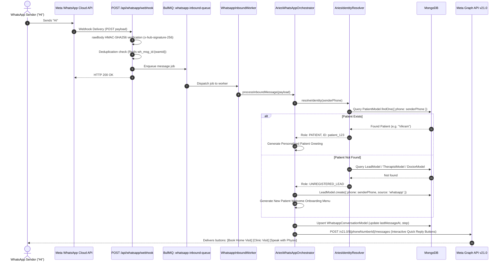

# DEEP DIVE 05: FORENSIC CODE TRACES & SECURITY AUDIT

## 1. Trace 1: What Happens When Someone Sends "Hi"?



---

## 2. Trace 2: Handling an Unknown / Clinical AI Question

**Query:** *"Can physiotherapy help my 68-year-old mother after a stroke in HSR Layout?"*

```
1. Ingress & Signature:
   - Webhook received at /api/whatsapp/webhook.
   - HMAC-SHA256 signature verified against META_APP_SECRET.
   - Idempotency confirmed via Redis key.

2. Enqueue & Dequeue:
   - Payload pushed to BullMQ 'whatsapp-inbound-queue'.
   - WhatsappInboundWorker picks up the job.

3. Role & Triage Detection:
   - AriesIdentityResolver confirms sender.
   - AriesWhatsAppOrchestrator inspects message text.
   - Regular expressions find no command matches ("CANCEL", "RESCHEDULE").
   - Intent categorized as: CLINICAL_TRIAGE.

4. PHI De-Identification & Safety Sentinel:
   - aiWhatsapp.service.ts scrubs any phone numbers, email addresses, or IDs.
   - Scans for acute life-threatening symptoms (active loss of consciousness, choking).
   - Flag: False (Non-acute rehabilitation query) -> Safe to proceed.

5. RAG & AI Orchestration:
   - WhatsappRAGService executes Qdrant vector search for "Stroke rehabilitation protocol".
   - Context retrieved: Aries Neuro-Rehab bundle, therapist availability in South Bangalore.
   - Injects clinical persona prompt into AIOrchestrator.generateResponse().

6. Model Execution Cascade:
   - Calls OmniRoute (gemini/gemini-2.5-flash).
   - If OmniRoute returns 200 within 2,100ms, response is parsed and validated.
   - If OmniRoute fails, cascades to Direct Gemini 3.6 -> OpenRouter Claude 3 -> Ollama -> Local Hardcoded Protocol #11 (Stroke Neuro-Rehab).

7. Persistence & Delivery:
   - Inbound and outbound messages written to 'whatsapp_messages' in MongoDB.
   - Outbound reply dispatched via Meta Graph API:
     "Yes, specialized neuro-physiotherapy is crucial for stroke recovery..."
   - Appends interactive buttons: [Book Home Assessment] [Consult Specialist].
```

---

## 3. Trace 3: Business Booking Action

**Query:** *"Book physiotherapy home visit tomorrow at 5 PM."*

```
1. Ingress & Routing:
   - Arrives via WhatsApp webhook.
   - AriesWhatsAppOrchestrator routes message to WhatsAppReceptionistAgent ("Aria").

2. NLP Entity Extraction:
   - Target Service: Physiotherapy (Home Care)
   - Target Date: Resolved to tomorrow's ISO date string
   - Target Time: 17:00:00

3. Missing Entity Evaluation:
   - Aria identifies missing mandatory field: Patient Locality / Address.
   - Bot asks: "I'd be glad to schedule that! Could you please tell me your area or share your location?"
   - Patient replies: "Indiranagar, near Metro Station".

4. Clinician Availability Check:
   - Queries TherapistModel in MongoDB:
     Finds active physiotherapists covering Bangalore East / Indiranagar with open 17:00 slots.
   - Therapist identified.

5. Record Provisioning:
   - Creates tentative record in AppointmentModel (status: 'tentative').
   - Links or updates LeadModel (stage: 'APPOINTMENT_SCHEDULED').

6. Confirmation & Payment Trigger:
   - Generates a Razorpay payment link for consultation deposit (₹799).
   - Bot delivers confirmation message:
     "Your home visit is scheduled for tomorrow at 5:00 PM in Indiranagar. Please confirm by completing your booking fee below."
   - Delivers dynamic Razorpay payment CTA button.
   - Emits internal operational alert via ExecutiveNotificationRoutes.
```

---

## 4. Security & Compliance Audit

### Protected Dimensions
1. **Zero Hardcoded Secrets:** Global scans across all `.ts`, `.js`, and `.json` files verified that **no API tokens, database passwords, or private keys are hardcoded in source control**.
2. **Encrypted Credentials in DB:** Access tokens stored in `WhatsappAccountModel` are encrypted using AES-256-GCM. Decryption keys are loaded strictly from `WHATSAPP_TOKEN_ENCRYPTION_KEY` or `JWT_SECRET`.
3. **Constant-Time Verification:** Webhook authentication employs `crypto.timingSafeEqual` to prevent side-channel timing attacks.
4. **PHI/PII Sanitization:** The pipeline in `aiWhatsapp.service.ts` actively de-identifies patient messages before transmission to third-party LLM providers.

### Vulnerabilities & Architectural Risks
1. **Therapist Race Condition:** When broadcasting home-visit leads, `btn_th_accept` does not acquire a distributed Redis lock on the appointment ID. If two therapists tap "Accept" simultaneously, both receive positive acknowledgements before database reconciliation.
2. **Takeover Expiration Gaps:** If an administrator enables `isHumanTakeover: true` but forgets to click "Resume Bot", the conversation remains muted indefinitely unless the optional `takeoverExpiresAt` timestamp was set.
