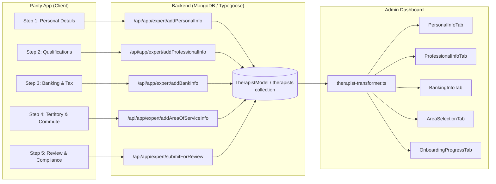
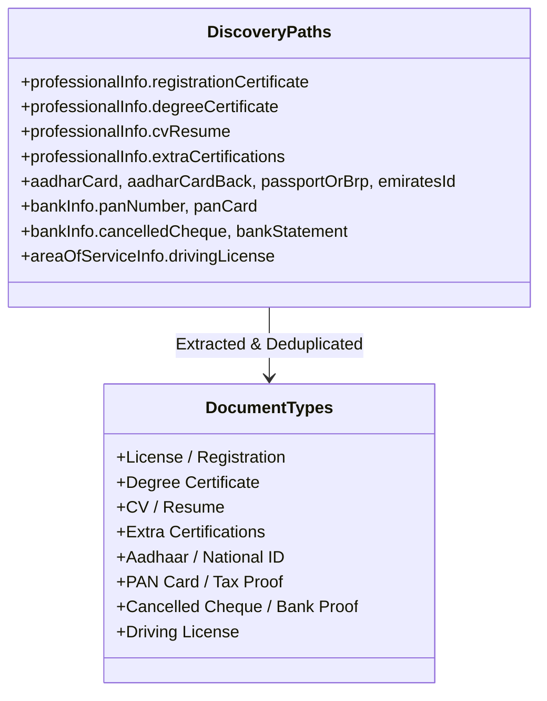

# AriesXpert Ecosystem: Master Onboarding Field Mapping

**Document Version:** 2.0 (Production Master)  
**Scope:** Complete cross-tier field alignment between **Parity App (`Aries-PhysioCare-Parity-App`)**, **Backend (`ariesxpert-backend`)**, and **Admin Dashboard (`AriesXpert-Admin-Dashboard`)**.

---

## Executive Architecture Summary

The AriesXpert Onboarding Ecosystem operates across three integrated layers:
1. **Client Tier (Parity App & Website)**: 5-step interactive onboarding wizard (`/onboarding`), dynamic country-specific configs, autosaving local drafts, and multipart/form-data upload flows.
2. **Backend API Tier (`ariesxpert-backend`)**: Express + Typegoose/MongoDB persistence models (`Therapist`, `ProfessionalInfo`, `BankInfo`, `AreaOfServiceInfo`, `UploadedDocument`), JWT-authenticated controllers, S3 document storage, and OTP/email verification logic.
3. **Admin Tier (`AriesXpert-Admin-Dashboard`)**: Multi-path fallback transformer (`therapist-transformer.ts`), document preview categorization, verification matrix, PII masking, and 5-tab detail view.

---

## 1. Step-by-Step Field Mapping Matrix

### Step 1: Personal Details & Identity Proof

| UI / Form Field (Parity App) | Frontend Payload Key (`FormData`) | Backend MongoDB Path (`Therapist`) | Admin Dashboard Path (`TransformedTherapist`) | Data Type & Validation / Format |
| :--- | :--- | :--- | :--- | :--- |
| **First Name** | `firstName` | `firstName` | `firstName`, `name` (combined) | `String` (Required) |
| **Last Name** | `lastName` | `lastName` | `lastName`, `name` (combined) | `String` (Required) |
| **Full Name** | `fullName` | `fullName` | `name` | `String` (concatenated `firstName + lastName`) |
| **Gender** | `gender` | `gender` | `profile.personalDetails.gender` | `Enum`: `'Male'`, `'Female'`, `'Other'` |
| **Date of Birth** | `dob` | `dob` | `profile.personalDetails.dob`, `age` (derived) | `Date` (ISO / YYYY-MM-DD) |
| **Email Address** | `email` | `email` | `profile.contact.email` | `String` (Email format, lowercase, unique) |
| **Mobile Number** | `phone` | `phone` | `profile.contact.phone` | `String` (10-digit clean string, unique) |
| **Password** | `password` | `password` | *N/A (Hidden/Hashed)* | `String` (Bcrypt hash, min 7 chars, uppercase, number, special char) |
| **Mobile Verified Flag** | `isMobileNumberVerified` | `isMobileNumberVerified`, `mobile_verified` | `profile.contact.mobileVerified`, `mobile_verified` | `Boolean` (Default `true` upon OTP verification) |
| **Email Verified Flag** | *Triggered via verification link* | `email_verified` | `profile.contact.emailVerified`, `email_verified` | `Boolean` |
| **Country Code** | `countryCode` | `countryCode` | `profile.contact.countryCode` | `String` (e.g. `'+91'`, `'+1'`, `'+44'`, `'+49'`, `'+971'`) |
| **Country Name** | `countryName` | `countryName` | `profile.address.country` | `String` (e.g. `'India'`, `'Canada'`, `'United Kingdom'`, etc.) |
| **Street Address (Line 1)**| `streetAddress` | `streetAddress`, `address` | `profile.address.line1` | `String` |
| **Address Line 2** | `addressLineTwo` | `addressLineTwo` | `profile.address.line2` | `String` |
| **City** | `city` | `city` | `city`, `location`, `profile.address.city` | `String` (Required) |
| **State / Province** | `state` | `state` | `profile.address.state` | `String` (Required) |
| **Postal Code / Pincode** | `zipCode` | `zipCode` | `profile.address.pincode` | `String` (Required) |
| **Locality / Area** | `area` | `area` | `profile.serviceableAreas.area` | `String` |
| **Profile Photo (Upload/URL)** | `profilePhoto`, `profilePhotoUrl` | `profilePhoto`, `originalProfilePhoto` | `profileImage`, `PersonalInfoTab` preview | `File` (Binary Multipart) / S3 `URL` |
| **Referral Code** | `referralCode` | `referredBy` (Ref to `Therapist`), `isReferred` | `ReferralsTab` | `String` (AX-ID lookup) |
| **Aadhaar Number (India)** | `aadharNumber` | `aadharNumber` | `profile.personalDetails.aadharNumber` | `String` (Masked: `****XXXX`) |
| **Aadhaar Card Front (India)**| `aadharCard` | `aadharCard` | `profile.personalDetails.aadharCard`, `personalIdentityDocs` | S3 `URL` (Image/PDF) |
| **Aadhaar Card Back (India)** | `aadharCardBack` | `aadharCardBack` | `profile.personalDetails.aadharCardBack`, `personalIdentityDocs` | S3 `URL` (Image/PDF) |
| **National Insurance No (UK)**| `nationalInsuranceNumber` | `nationalInsuranceNumber` | `profile.personalDetails.nationalInsuranceNumber` | `String` |
| **Passport / BRP (UK)** | `passportOrBrp` | `passportOrBrp` | `profile.personalDetails.passportOrBrp` | S3 `URL` (Image/PDF) |
| **Personalausweis (Germany)** | `personalausweis` | `personalausweis` | `profile.personalDetails.personalausweis` | S3 `URL` (Image/PDF) |
| **Anmeldung Doc (Germany)** | `anmeldungDocument` | `anmeldungDocument` | `profile.personalDetails.anmeldungDocument` | S3 `URL` (Image/PDF) |
| **Emirates ID (UAE)** | `emiratesId` | `emiratesId` | `profile.personalDetails.emiratesId` | S3 `URL` (Image/PDF) |
| **Passport & Visa (UAE)** | `passportVisa` | `passportVisa` | `profile.personalDetails.passportVisa` | S3 `URL` (Image/PDF) |
| **SSN Number (US)** | `ssnNumber` | `ssnNumber` | `profile.personalDetails.ssnNumber` | `String` (Masked) |
| **Driver's License (US)** | `driversLicense` | `driversLicense` | `profile.personalDetails.driversLicense` | S3 `URL` (Image/PDF) |
| **Government Photo ID (CA)** | `governmentPhotoId` | `governmentPhotoId` | `profile.personalDetails.governmentPhotoId` | S3 `URL` (Image/PDF) |
| **Onboarding Step Tracker** | *Auto-set* | `onboardingStep = 1` | `OnboardingProgressTab` (Step 1 complete) | `Number` (0 to 5) |

---

### Step 2: Professional Qualifications & Council Licensing

| UI / Form Field (Parity App) | Frontend Payload Key (`FormData`) | Backend MongoDB Path (`Therapist`) | Admin Dashboard Path (`TransformedTherapist`) | Data Type & Validation / Format |
| :--- | :--- | :--- | :--- | :--- |
| **Professional Role / Designation** | `professionalRole`, `designation` | `therapistProfessionalRole`, `professionalInfo.professionalRole`, `designation` | `professionalRole`, `profile.professionalInfo.profession` | `String` (`'Physiotherapist'`, `'Occupational Therapist'`, `'Nurse'`, `'Dietician'`, `'Care Taker'`) |
| **Primary Qualification** | `qualification`, `specialization` | `qualification`, `professionalInfo.qualification` | `profile.professionalInfo.qualification` | `String` (`'BPT / BPTH'`, `'MPT / MPTH'`, `'BOT'`, `'GNM'`, etc.) |
| **Clinical Specializations** | `specializations` | `professionalInfo.specializations`, `specialization[]`, `primarySpecialization` | `profile.professionalInfo.specialization` (joined), `specialization` | `Array<String>` (`'Musculoskeletal'`, `'Neurological'`, `'Cardiopulmonary'`, `'Sports'`, `'Pediatric'`, etc.) |
| **Extra Certifications** | `extraCertifications`, `certifications` | `professionalInfo.extraCertifications` (`[{ name, url }]`) | `profile.professionalInfo.extraCertifications` | `Array<UploadedDocument>` (`'Taping'`, `'Dry Needling'`, `'Cupping'`, `'IASTM'`, `'McKenzie'`, etc.) |
| **Years of Experience** | `yearOfExperience`, `yearsOfExperience` | `professionalInfo.yearOfExperience`, `experience` (`Number`), `yearsOfExperience` | `experience` (`String` / formatted `"X years"`), `profile.professionalInfo.experience` | `String` / `Number` (`'Fresher'`, `'0–1 Years'`, `'1–3 Years'`, `'3–5 Years'`, `'5–10 Years'`, `'10+ Years'`) |
| **Council Registration / License Number** | `licenseNumber`, `councilRegistrationNumber` | `licenseNumber`, `professionalInfo.councilRegistrationNumber`, `professionalInfo.licenseNumber` | `profile.professionalInfo.licenseNumber` | `String` (e.g. State OTPT Council reg number, HCPC reg number, DHA license) |
| **State Council / Authority Name** | `councilName` | `professionalInfo.councilName` | `profile.professionalInfo.councilName` | `String` |
| **Currently Employed Flag** | `currentlyWorking` | `currentlyWorking` | *Derived in Admin View* | `Boolean` |
| **Current Workplace / Institute** | `currentlyWorkingAt` | `professionalInfo.currentlyWorkingAt` | `profile.professionalInfo.currentlyWorkingAt` | `String` (Hospital / Clinic name or `'No'`) |
| **Therapy Service Modalities** | `serviceTypes` | `professionalInfo.serviceTypes` | `profile.professionalInfo.serviceTypes` | `Array<String>` (`'Home Visit'`, `'Clinic Visit'`, `'Telehealth'`) |
| **Has Modality Equipment** | `hasModalities` | `professionalInfo.hasModalities` | `profile.professionalInfo.hasModalities` | `Boolean` (TENS, Ultrasound, IFT, Traction) |
| **Owns Private Clinic** | `hasOwnClinic` | `professionalInfo.hasOwnClinic` | `profile.professionalInfo.hasOwnClinic` | `Boolean` |
| **Private Clinic Name** | `clinicName` | `professionalInfo.clinicName` | `profile.professionalInfo.clinicName` | `String` |
| **Clinic Establishment Month** | `clinicEstablishmentMonth` | `professionalInfo.clinicEstablishmentMonth` | `profile.professionalInfo.clinicEstablishmentMonth` | `String` (`'January'`, `'February'`, etc.) |
| **Clinic Establishment Year** | `clinicEstablishmentYear` | `professionalInfo.clinicEstablishmentYear` | `profile.professionalInfo.clinicEstablishmentYear` | `String` (e.g. `'2020'`) |
| **Registration Certificate Doc**| `registrationCertificate` | `professionalInfo.registrationCertificate` (`{ name, url }`) | `profile.professionalInfo.documents[type='License']` | S3 `URL` (PDF/Image preview + download) |
| **Degree Certificate Doc** | `degreeCertificate` | `professionalInfo.degreeCertificate` (`{ name, url }`) | `profile.professionalInfo.documents[type='Degree Certificate']` | S3 `URL` (PDF/Image preview + download) |
| **CV / Resume Doc** | `cvResume` | `professionalInfo.cvResume` (`{ name, url }`) | `profile.professionalInfo.documents[type='CV/Resume']` | S3 `URL` (PDF/Image preview + download) |
| **Dynamic Extra Cert Files** | `extraCertification_0..N` | `professionalInfo.extraCertifications` | `profile.professionalInfo.documents[type='Extra Certifications']` | S3 `URL` (PDF/Image preview + download) |
| **Onboarding Step Tracker** | *Auto-set* | `onboardingStep = 2` | `OnboardingProgressTab` (Step 2 complete) | `Number` |

---

### Step 3: Banking & Payout Setup (Direct IMPS / Direct Deposit)

| UI / Form Field (Parity App) | Frontend Payload Key (`FormData`) | Backend MongoDB Path (`Therapist`) | Admin Dashboard Path (`TransformedTherapist`) | Data Type & Validation / Format |
| :--- | :--- | :--- | :--- | :--- |
| **Account Type** | `accountType` | `bankInfo.accountType` | `profile.bankingInfo.accountType` | `Enum`: `'Savings'`, `'Current'`, `'Individual'`, `'Business'` |
| **Business / Entity Name** | `businessName` | `bankInfo.businessName` | `profile.bankingInfo.businessName` | `String` (Required for Current account) |
| **Account Holder Name** | `accountHolderName` | `bankInfo.accountHolderName` | `profile.bankingInfo.accountHolderName` | `String` (Name matching bank record) |
| **Bank Name** | `bankName` | `bankInfo.bankName` | `profile.bankingInfo.bankName` | `String` (e.g. `'HDFC Bank'`, `'State Bank of India'`, `'RBC'`) |
| **Bank Account Number** | `accountNumber` | `bankInfo.accountNumber` | `profile.bankingInfo.accountNumber` | `String` (Masked in Admin UI: `****XXXX`) |
| **IFSC Code (India)** | `ifscCode` | `bankInfo.ifscCode` | `profile.bankingInfo.ifscCode` | `String` (Regex: `^[A-Z]{4}0[A-Z0-9]{6}$`) |
| **UPI ID (Fast Payouts - India)**| `upiId` | `bankInfo.upiId` | `profile.bankingInfo.upiId` | `String` (e.g. `'username@okaxis'`) |
| **PAN Number (India)** | `panNumber` | `bankInfo.panNumber`, `panCard` | `profile.bankingInfo.panCard`, `panCard` | `String` (Regex: `^[A-Z]{5}[0-9]{4}[A-Z]{1}$`, Masked) |
| **Sort Code (UK)** | `sortCode` | `bankInfo.sortCode` | `profile.bankingInfo.sortCode` | `String` (`XX-XX-XX`) |
| **UTR Number (UK)** | `utrNumber` | `bankInfo.utrNumber` | `profile.bankingInfo.utrNumber` | `String` (10 digits) |
| **Routing Number (US)** | `routingNumber` | `bankInfo.routingNumber` | `profile.bankingInfo.routingNumber` | `String` (ABA 9 digits) |
| **SSN / EIN (US)** | `ssnEinNumber` | `bankInfo.ssnEinNumber` | `profile.bankingInfo.ssnEinNumber` | `String` |
| **Transit Number (Canada)** | `transitNumber` | `bankInfo.transitNumber` | `profile.bankingInfo.transitNumber` | `String` (5 digits) |
| **Institution Number (Canada)**| `institutionNumber` | `bankInfo.institutionNumber` | `profile.bankingInfo.institutionNumber` | `String` (3 digits) |
| **SIN Number (Canada)** | `sinNumber` | `bankInfo.sinNumber` | `profile.bankingInfo.sinNumber` | `String` (`XXX-XXX-XXX`) |
| **IBAN (UAE / Germany)** | `accountNumber` | `bankInfo.accountNumber` | `profile.bankingInfo.accountNumber` | `String` (IBAN format) |
| **Steuer-ID / Tax ID (DE)** | `taxId` | `bankInfo.taxId`, `bankInfo.panNumber` | `profile.bankingInfo.panCard` | `String` (11 digits) |
| **Cancelled Cheque / Passbook**| `cancelledCheque` | `bankInfo.cancelledCheque` (`{ name, url }`) | `profile.bankingInfo.cancelledChequeUrl`, `BankingInfoTab` preview | S3 `URL` (Image/PDF preview + download) |
| **Bank Statement Header** | `bankStatement` | `bankInfo.bankStatement` (`{ name, url }`) | `profile.bankingInfo.bankStatementUrl` | S3 `URL` (Image/PDF preview + download) |
| **Bank Verification Status** | *Admin Controlled* | `bankInfo.bankVerificationStatus` | `profile.bankingInfo.bankVerificationStatus` | `Enum`: `'pending'`, `'approved'`, `'rejected'` |
| **Bank Rejection Reason** | *Admin Controlled* | `bankInfo.rejectionReason` | `profile.bankingInfo.rejectionReason` | `String` |
| **Onboarding Step Tracker** | *Auto-set* | `onboardingStep = 3` | `OnboardingProgressTab` (Step 3 complete) | `Number` |

---

### Step 4: Service Territory & Commute Dispatch

| UI / Form Field (Parity App) | Frontend Payload Key (`FormData`) | Backend MongoDB Path (`Therapist`) | Admin Dashboard Path (`TransformedTherapist`) | Data Type & Validation / Format |
| :--- | :--- | :--- | :--- | :--- |
| **Operating Base City** | `serviceCity`, `city` | `areaOfServiceInfo.city`, `city` | `city`, `location`, `profile.address.city` | `String` (e.g. `'Mumbai'`, `'Bangalore'`, `'Toronto'`) |
| **Operational Sub-Localities** | `serviceAreas` | `areaOfServiceInfo.serviceAreas`, `serviceAreas[]` | `profile.serviceableAreas.serviceAreas`, `area` | `Array<String>` (e.g. `['Bandra West', 'Andheri West', 'Juhu']`) |
| **Target Service Pincodes** | `targetPincodes`, `pincode` | `areaOfServiceInfo.targetPincodes`, `targetPincodes[]`, `areaOfServiceInfo.pincode` | `profile.serviceableAreas.pincodes` (geocoded on Map) | `Array<String>` (e.g. `['400050', '400053', '400058']`) |
| **Operating Radius** | `serviceRadius` | `areaOfServiceInfo.serviceRadius` | `profile.serviceableAreas.serviceRadius` | `Number` in km (Default: `12` km) |
| **Max Travel Distance** | `maxDistance` | `areaOfServiceInfo.maxDistance` | `profile.serviceableAreas.maxDistance` | `Number` in km (Default: `25` km) |
| **Commute Transport Mode** | `commuteType` | `areaOfServiceInfo.commuteType` | `profile.serviceableAreas.commuteMode` | `Enum`: `'Two Wheeler (Bike / Scooter)'`, `'Four Wheeler (Car)'`, `'Public Transit / Metro & Auto'`, `'Bicycle / Walking (Nearby)'` |
| **Driving License Number** | `drivingLicenseNumber` | `areaOfServiceInfo.drivingLicenseNumber` | `profile.serviceableAreas.drivingLicenseNumber` | `String` |
| **Driving License Doc** | `drivingLicense` | `areaOfServiceInfo.drivingLicense` (`{ name, url }`) | `profile.serviceableAreas.drivingLicenseUrl` | S3 `URL` (Image/PDF preview + download) |
| **Daily Home Visit Capacity** | `travelCapacity` | `areaOfServiceInfo.travelCapacity` | `profile.serviceableAreas.travelCapacity` | `Enum`: `'Up to 3 visits per day'`, `'Up to 5 visits per day'`, `'6–8 visits per day'`, `'8+ visits per day'` |
| **Urgent / Emergency Visits** | `urgentVisits` | `areaOfServiceInfo.urgentVisits` | `profile.serviceableAreas.urgentVisits` | `Boolean` (Default `true`) |
| **Preferred Travel Window** | `travelTimePreference` | `areaOfServiceInfo.travelTimePreference` | `profile.serviceableAreas.travelTimePreference` | `Enum`: `'Flexible / Anytime (8:00 AM – 9:00 PM)'`, `'Morning Focus (7:00 AM – 1:00 PM)'`, `'Evening Focus (3:00 PM – 9:00 PM)'`, `'Weekends Only'` |
| **Onboarding Step Tracker** | *Auto-set* | `onboardingStep = 4` | `OnboardingProgressTab` (Step 4 complete) | `Number` |

---

### Step 5: Review, Compliance Declarations & Approval Lifecycle

| UI / Form Field (Parity App) | Frontend Payload Key (`FormData` / Body) | Backend MongoDB Path (`Therapist`) | Admin Dashboard Path (`TransformedTherapist`) | Data Type & Validation / Format |
| :--- | :--- | :--- | :--- | :--- |
| **Clinical Declaration Agreement** | `declarationTrue` | *Verified pre-submit* | `VerificationMatrixSection` | `Boolean` (Mandatory `true`) |
| **Clinical Safety Guidelines** | `agreeClinicalGuidelines` | *Verified pre-submit* | `VerificationMatrixSection` | `Boolean` (Mandatory `true`) |
| **Doorstep Safety Protocol** | `agreeDoorstepSafety` | *Verified pre-submit* | `VerificationMatrixSection` | `Boolean` (Mandatory `true`) |
| **Terms & Privacy Policy** | `agreeTermsAndPolicies` | *Verified pre-submit* | `VerificationMatrixSection` | `Boolean` (Mandatory `true`) |
| **Registration Fee Payment** | `paymentProof`, `transactionId` | `isOnboardingPaid`, `transaction` (Ref to `Transaction`) | `isOnboardingPaid`, `PaymentApprovalTab`, `paymentInfo` | `Boolean` / `Ref` (`₹999` INR, `$49` CAD, `£39` GBP, etc.) |
| **Final Review Submission** | `POST /api/app/expert/submitForReview` | `status = 'Pending'`, `onboardingStatus = 'pending'`, `isProfileActive = false`, `onboardingStep = 5` | `approvalInfo.onboardingStatus`, `OnboardingProgressTab` (100% complete) | `Status Enum`: `'Pending'`, `'Approved'`, `'Rejected'`, `'Suspended'` |
| **Admin Approval Action** | `PUT /therapists/:id/status` (`'Approved'`) | `status = 'Approved'`, `onboardingStatus = 'approved'`, `isProfileActive = true`, `isTherapistActive = true` | `approvalInfo.onboardingStatus = 'approved'`, `approvalInfo.approvedAt`, `approvalInfo.approvedBy` | `Timestamp` & `Admin ID` |
| **Admin Rejection Action** | `PUT /therapists/:id/status` (`'Rejected'`) | `status = 'Rejected'`, `onboardingStatus = 'rejected'`, `rejectionReason = '...'`, `isProfileActive = false` | `approvalInfo.onboardingStatus = 'rejected'`, `approvalInfo.rejectionReason` | `String` (Reason displayed to therapist in app) |
| **Permanent Aries Unique ID** | *Backend Generated* | `ariesId`, `axId` | `axId` (e.g. `'AX-IND-1234'`, `'AX-CAN-5678'`) | `String` (Unique alphanumeric code) |

---

## 2. Multi-Country Identity & Regulatory Matrix

| Country | Primary Registration Body / Authority | License Field in Schema | National Identity Document (Front & Back) | Tax Identification Field | Banking Verification Document |
| :--- | :--- | :--- | :--- | :--- | :--- |
| **India 🇮🇳** | State Council (e.g. Maharashtra OTPT Council / IAP) | `licenseNumber`, `professionalInfo.councilRegistrationNumber` | `aadharNumber`, `aadharCard`, `aadharCardBack` | `panNumber`, `panCard` | `cancelledCheque` (or Passbook Front Page) |
| **United Kingdom 🇬🇧**| Health & Care Professions Council (HCPC / CSP) | `licenseNumber` | `nationalInsuranceNumber`, `passportOrBrp` | `utrNumber` | `bankStatement` (or Direct Debit Form) |
| **United States 🇺🇸**| State Physical Therapy Board (e.g. PT-XXXXXX) | `licenseNumber` | `ssnNumber`, `driversLicense` | `ssnEinNumber` | `cancelledCheque` (Voided Check / Direct Deposit) |
| **Canada 🇨🇦** | Provincial Regulatory College (e.g. CPO Ontario) | `licenseNumber` | `governmentPhotoId` | `sinNumber` | `cancelledCheque` (Void Cheque / Pre-Auth Debit) |
| **UAE / Dubai 🇦🇪** | Dubai Health Authority (DHA / MOHAP / DoH) | `licenseNumber` (e.g. `DHA-P-0123456`) | `emiratesId`, `passportVisa` | *Corporate Tax / N/A* | `bankVerificationLetter` (Bank Account Letter) |
| **Germany 🇩🇪** | Landesbehörde (Berufsurkunde / Approbation) | `licenseNumber` (e.g. `DE-PT-54321`) | `personalausweis`, `anmeldungDocument` | `taxId` (Steuer-ID 11 digits) | `bankStatement` (Kontoauszug Header) |

---

## 3. Document Categorization & Transformation Architecture

The Admin Dashboard (`therapist-transformer.ts` & `transform-utils.ts`) automatically discovers documents across both **legacy flat schema fields** and **nested `professionalInfo` / `bankInfo` / `areaOfServiceInfo`** objects, mapping them into standard visual categories:

| Visual Category (Admin UI) | Target Tab in Admin Dashboard | Discovery Extraction Paths in MongoDB Document | Preview / Download Capabilities |
| :--- | :--- | :--- | :--- |
| **License / Registration** | `ProfessionalInfoTab` | `professionalInfo.registrationCertificate.url`, `registrationCertificateUrl`, `registrationCertificate` | In-app PDF/Image Viewer + Direct Download |
| **Degree Certificate** | `ProfessionalInfoTab` | `professionalInfo.degreeCertificate.url`, `degreeCertificateUrl`, `degreeCertificate` | In-app PDF/Image Viewer + Direct Download |
| **CV / Resume** | `ProfessionalInfoTab` | `professionalInfo.cvResume.url`, `cvResumeUrl`, `cvResume` | In-app PDF/Image Viewer + Direct Download |
| **Extra Certifications** | `ProfessionalInfoTab` | `professionalInfo.extraCertifications[].url`, `extraCertifications[]` | In-app PDF/Image Viewer + Direct Download |
| **Aadhaar / National ID** | `PersonalInfoTab` | `aadharCard`, `aadharCardBack`, `passportOrBrp`, `emiratesId`, `personalausweis`, `governmentPhotoId` | In-app PDF/Image Viewer + Direct Download |
| **PAN Card / Tax Proof** | `BankingInfoTab` | `panCard`, `bankInfo.panNumber`, `bankInfo.panCard.url` | In-app Image Viewer + Direct Download |
| **Cancelled Cheque / Passbook**| `BankingInfoTab` | `bankInfo.cancelledCheque.url`, `cancelledCheque`, `bankStatement`, `bankVerificationLetter` | In-app PDF/Image Viewer + Direct Download |
| **Driving License** | `AreaSelectionTab` | `areaOfServiceInfo.drivingLicense.url`, `drivingLicenseUrl`, `drivingLicense` | In-app Image Viewer + Direct Download |

---

## 4. Telehealth Onboarding Sub-Module

For practitioners activating Telehealth & Virtual Consultation capabilities:

| Telehealth Onboarding Metric | MongoDB Schema Field (`Therapist`) | Admin Dashboard Lifecycle Matrix | Purpose & Quality Benchmark |
| :--- | :--- | :--- | :--- |
| **Digital Telehealth Agreement** | `telehealthAgreementSigned`, `telehealthAgreementSignedAt` | `VerificationMatrixSection` | Legal tele-rehabilitation consent & signature timestamp |
| **Telehealth Verification Status**| `telehealthApproved`, `telehealthApprovedAt` | `VerificationMatrixSection` | Clinical director sign-off for virtual consults |
| **Video Camera Quality Check** | `telehealthVideoChecked`, `telehealthQualityScore` | `ClinicalPerformanceSection` | 720p/1080p camera clarity check (Score 0–100) |
| **Background Noise Level (dB)** | `telehealthMetrics.noiseLevelDb` | `ClinicalPerformanceSection` | Acoustic diagnostic check (< 45 dB required) |
| **Lighting Score** | `telehealthMetrics.lightingScore` | `ClinicalPerformanceSection` | Frontal illumination score (Score 0–100) |
| **Internet Bandwidth (Mbps)** | `telehealthMetrics.speedMbps` | `ClinicalPerformanceSection` | Network latency & bandwidth check (>= 15 Mbps required) |
| **Clinic / Room Setup Photos** | `telehealthOnboardingPics` (`Array<String>`) | `VerificationMatrixSection` | 360-degree virtual clinic acoustic & privacy proof photos |

---

## 5. Patient Intake & Onboarding Schema Mapping

For end-to-end completeness, the patient intake flow maps into `PatientModel` (`patients` collection) and transforms via `patient-transformer.ts`:

| Patient Field (Client Intake) | MongoDB Path (`Patient`) | Admin Dashboard Path (`TransformedPatient`) | Type / Format |
| :--- | :--- | :--- | :--- |
| **First Name** | `firstName` | `firstName`, `name` (combined) | `String` |
| **Last Name** | `lastName` | `lastName`, `name` (combined) | `String` |
| **Phone Number** | `phone` | `phone`, `profile.contact.phone` | `String` (10 digits) |
| **Email Address** | `email` | `email`, `profile.contact.email` | `String` (lowercase) |
| **Age** | `age` | `age`, `profile.personalDetails.age` | `Number` |
| **Gender** | `gender` | `gender`, `profile.personalDetails.gender` | `Enum`: `'Male'`, `'Female'`, `'Other'` |
| **Date of Birth** | `dob` | `profile.personalDetails.dob` | `Date` (ISO) |
| **Address Line 1** | `address` | `profile.address.line1` | `String` |
| **City** | `city` | `city`, `profile.address.city` | `String` |
| **Pincode / Postal Code** | `pincode` | `profile.address.pincode` | `String` |
| **Country** | `country` | `profile.address.country` (Default `'India'`) | `String` |
| **Primary Condition / Chief Complaint** | `condition` | `profile.medicalInfo.condition` | `String` (e.g. `'ACL Tear'`, `'Lower Back Pain'`) |
| **Medical History / Comorbidities** | `medicalHistory` | `profile.medicalInfo.medicalHistory` | `Array<String>` |
| **Clinical Consent Given** | `consentGiven` | `profile.consent.consentGiven` | `Boolean` |
| **Assigned Expert / Practitioner** | `assignedTherapist` | `profile.assignedTherapist.therapistId` | `ObjectId` (Ref to `Therapist`) |
| **Patient Status** | `status` | `status` | `Enum`: `'Active'`, `'Discharged'`, `'Pending'`, `'On-Hold'`, `'Inactive'` |

---

## 6. Audit & Verification Checklist for Full Parity

- [x] **Client Form Completeness**: All 5 steps in `Aries-PhysioCare-Parity-App/src/app/onboarding/page.tsx` match the mobile app step sequence 1:1.
- [x] **Autosave & Hydration**: Local storage key `onboarding_full_draft_v3` mirrors all personal, professional, bank, and territory fields for lossless reload.
- [x] **Multipart S3 Uploads**: All 8 document types correctly handled by multer/busboy on backend and stored with S3 URLs.
- [x] **Multi-Country Support**: 6 localized regulatory setups (India, UK, US, Canada, UAE, Germany) fully supported in form UI, model schemas, and admin display.
- [x] **Masking & Security**: PII (Aadhaar, Account Number, PAN, SSN) masked in Admin UI while preserving backend verification integrity.
- [x] **Bidirectional Updates**: Admin edits in `PersonalInfoTab`, `ProfessionalInfoTab`, `BankingInfoTab` persist back to MongoDB and instantly reflect in mobile app profile view.
