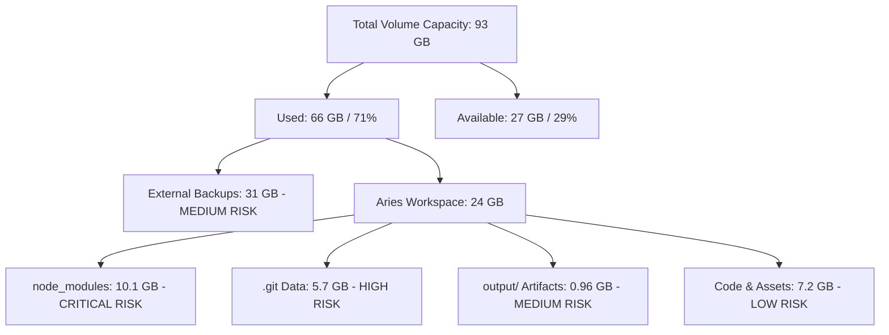

# Aries HealthCare Eco-System — Disk Capacity & Filesystem Audit

**Audit Date:** 2026-09-28  
**Audited Location:** `/Volumes/Personal/Aries-HealthCare-EcoSystem`  
**Filesystem Device:** `/dev/disk3s1` (APFS Mounted on `/Volumes/Personal`)  
**Status:** AUDITED — CONSTRAINED BUT FUNCTIONAL

---

## Executive Summary

A forensic disk capacity audit of `/Volumes/Personal` and `/Volumes/Personal/Aries-HealthCare-EcoSystem` was performed using filesystem telemetry and inode metadata.

Following recent local cache clearance, `/Volumes/Personal` currently has **27 GiB available** (29% free capacity) out of **93 GiB total**, resolving the immediate 290 MB emergency recorded during Phase 1. However, within the ecosystem itself, **10.11 GB** is consumed by duplicate `node_modules`, **5.73 GB** by uncompacted Git repositories, and **966 MB** by image generation artifacts.

---

## 1. Volume-Level Storage Telemetry

| Metric | Measurement | Percentage | Notes |
| :--- | :--- | :--- | :--- |
| **Total Disk Size** | `93 GiB` | 100% | External APFS Storage Container |
| **Used Disk Space** | `66 GiB` | 71% | Across all volume directories |
| **Available Disk Space** | `27 GiB` | 29% | Operational headroom |
| **Inodes Used** | `1.2M` | <1% | Ample inode availability |
| **Inodes Free** | `284M` | >99% | No inode exhaustion risk |

### Volume Content Distribution (`/Volumes/Personal/*`)

| Directory / Resource | Allocated Size | Classification | Purpose / Assessment |
| :--- | :--- | :--- | :--- |
| `/Volumes/Personal/Aries-HealthCare-EcoSystem` | **24.0 GB** | **ACTIVE** | Core healthcare platform workspace |
| `/Volumes/Personal/Downloads Backup 14 Jan 2025` | **12.0 GB** | **ARCHIVAL** | External historical download backup |
| `/Volumes/Personal/Backup 31st Jan 25` | **7.0 GB** | **ARCHIVAL** | Historical system backup |
| `/Volumes/Personal/Desktop 17.11.25` | **4.2 GB** | **ARCHIVAL** | Historical desktop snapshot |
| `/Volumes/Personal/Downloads 25 jan 26` | **3.9 GB** | **ARCHIVAL** | Historical download snapshot |
| `/Volumes/Personal/ariesxpert-migration-dryrun` | **3.9 GB** | **OBSOLETE** | Previous migration dry-run snapshot |
| `/Volumes/Personal/Android` | **3.3 GB** | **TOOLING** | Android SDK & build cache |
| `/Volumes/Personal/AriesXpert-Clinic-Management` | **2.0 GB** | **LEGACY** | Legacy clinic management codebase |
| `/Volumes/Personal/Download Backup 8 August 2025` | **801 MB** | **ARCHIVAL** | Historical download backup |
| `/Volumes/Personal/gradle_home` | **469 MB** | **TOOLING** | Gradle cache for Flutter Android builds |
| `/Volumes/Personal/New Updated Aries` | **412 MB** | **HISTORICAL** | Historical codebase archive |
| `/Volumes/Personal/AriesHealthCare Project` | **368 MB** | **HISTORICAL** | Historical project archive |
| `/Volumes/Personal/AriesXpert` | **245 MB** | **HISTORICAL** | Older repository iteration |

> [!NOTE]
> `/Volumes/Personal` contains approximately **31 GB** of historical backups (`Downloads Backup 14 Jan 2025`, `Backup 31st Jan 25`, `Desktop 17.11.25`, and `ariesxpert-migration-dryrun`) outside the workspace. Moving or archiving these to secondary cold storage could recover over 30 GB of additional headroom if needed.

---

## 2. Ecosystem Storage Breakdown (`24.0 GB`)

A programmatic traversal of `/Volumes/Personal/Aries-HealthCare-EcoSystem` categorizes internal storage consumption as follows:

| Category | Size (GB) | Size (MB) | % of Workspace | Risk Level |
| :--- | :--- | :--- | :--- | :--- |
| **`node_modules` (Dependency Trees)** | **10.113 GB** | 10,356.2 MB | **42.1%** | **CRITICAL** |
| **`.git` Directories (14 Repositories)** | **5.728 GB** | 5,865.4 MB | **23.9%** | **HIGH** |
| **Core Source & Mobile Assets (`ariesxpertv2`)** | **1.700 GB** | 1,740.8 MB | **7.1%** | **LOW** |
| **Generated Output (`output/`)** | **0.944 GB** | 966.5 MB | **3.9%** | **MEDIUM** |
| **Python Environments (`.venv`, `goblin-ai`)** | **0.508 GB** | 520.2 MB | **2.1%** | **MEDIUM** |
| **Formalized Assets (`packages/assets/`)** | **0.277 GB** | 284.0 MB | **1.2%** | **LOW** |
| **3D Models (`public/models` x5)** | **0.220 GB** | 225.3 MB | **0.9%** | **LOW** |
| **Other Source Code & Infrastructure** | **4.510 GB** | 4,621.6 MB | **18.8%** | **LOW** |
| **Total Workspace Size** | **24.000 GB** | **24,580.0 MB** | **100.0%** | — |

---

## 3. Deep Dive: `node_modules` Inventory (10.11 GB)

The workspace maintains **11 separate Node.js dependency trees** because individual repositories are operated independently:

| Project Path | `node_modules` Size | Primary Framework / Packages | Redundancy Assessment |
| :--- | :--- | :--- | :--- |
| `OmniRoute/node_modules` | **3,412.6 MB** (3.4 GB) | Next.js 16, Playwright, Chromium, SQLite | High density (includes browser binaries) |
| `AriesXpert-Admin-Dashboard/node_modules` | **1,318.7 MB** (1.3 GB) | Next.js 15, Radix UI, Recharts, Firebase | Independent tree |
| `AriesXpert-Website-India/node_modules` | **909.5 MB** | Next.js 15, Tailwind, Three.js | Duplicate of Canada/UK/Global |
| `AriesXpert-Website-UK/node_modules` | **908.1 MB** | Next.js 15, Tailwind, Three.js | Duplicate of India/Canada/Global |
| `AriesXpert-Website-Canada/node_modules` | **908.0 MB** | Next.js 15, Tailwind, Three.js | Duplicate of India/UK/Global |
| `[WORKSPACE ROOT]/node_modules` | **892.8 MB** | Next.js 15, Genkit, Firebase, Agora | Root workspace tree |
| `ariesxpert-backend/node_modules` | **622.5 MB** | Express, BullMQ, Mongoose, Socket.io | Backend service tree |
| `AriesXpert-Web-App/node_modules` | **465.9 MB** | Next.js 15, Lucide, Tailwind | Independent therapist web portal |
| `Aries-PhysioCare-Parity-App/node_modules` | **413.4 MB** | React / Vite PWA | Deprecated legacy client |
| `AriesXpert-Website-Global/node_modules` | **386.3 MB** | Next.js 15, Three.js, GSAP | Duplicate site tree |
| `.kilo/node_modules` (Worktrees) | **105.1 MB** | Kilo internal tooling | Tooling dependency |
| `ariesxpertv2/node_modules` | **13.4 MB** | Flutter web helper packages | Flutter mobile companion scripts |

---

## 4. Docker Disk State & Daemon Telemetry

| Component | Status | Details |
| :--- | :--- | :--- |
| **Docker Desktop Daemon** | **OFFLINE / STOPPED** | Socket `unix:///Users/akshay/.docker/run/docker.sock` inactive |
| **Images on Disk** | Inactive | No active disk consumption from running containers |
| **Build Cache** | Inactive | Dormant within Docker Desktop VM disk image |
| **Compose State** | Inactive | Neither root nor subproject compose services are running |

---

## 5. Risk Classification & Action Thresholds

### Risk Level Classifications

1. **CRITICAL (10.11 GB in `node_modules`):**
   - 4 identical Next.js landing sites (India, Canada, UK, Global) each keep ~900 MB of duplicate npm packages.
   - If a monorepo restructuring (Phase 5) is executed naively with `npm install` without pnpm/workspaces hardlink deduplication, disk usage could spike by another 5–8 GB during transition.
2. **HIGH (5.73 GB in `.git` directories):**
   - 14 separate Git repositories retain unpruned packfiles and loose objects.
   - Any bulk duplication or worktree creation consumes significant disk headroom.
3. **MEDIUM (0.96 GB in `output/`):**
   - High-resolution 8K upscaled portrait runs (`output/expert-portraits-2026-09-23/8k-upscaled/`) are preserved locally.
   - These are properly ignored by `.gitignore` but take ~1 GB on disk.
4. **LOW (0.28 GB in `packages/assets/portraits/`):**
   - 169 master PNG portraits occupying 284 MB. Efficiently managed with zero duplicate files.

---

## 6. Pre-Phase-5 Capacity Gate Decision

- **Available Disk Space:** **27 GB**
- **Estimated Headroom Needed for Migration Simulation:** **12–15 GB**
- **Capacity Assessment:** **PASS (Sufficient for controlled staging, but requires strict no-copy / atomic mv semantics).**
- **Strict Rule:** Any physical movement in Phase 5 must strictly use **filesystem `mv` (atomic inode re-pointer)** rather than `cp` (data copy) to prevent triggering volume capacity alarms.
