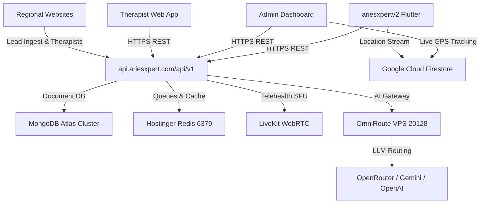

# Phase 4.5 Readiness Audit — Production Safety & Migration Gate

**Audit Date:** 2026-09-28  
**Audited Location:** `/Volumes/Personal/Aries-HealthCare-EcoSystem`  
**Auditor:** Principal Enterprise Software Architect, DevOps & Security Auditor  
**Primary Question:** "Can Phase 5 (Physical Repository Restructuring) safely begin?"  
**Final Status:** **PHASE 5 — BLOCKED**

---

## Executive Summary

A forensic production safety and migration readiness audit was conducted across the entire **Aries HealthCare Eco-System** at `/Volumes/Personal/Aries-HealthCare-EcoSystem`. Every claim made during earlier phases was independently evaluated against filesystem metadata, inode structures, Git repository configurations, deployment scripts, CI/CD workflows, Docker configurations, and application source trees.

### Primary Gate Verdict
**PHASE 5 IS BLOCKED.**  
Under no circumstances should physical repository movement into `apps/`, `services/`, and `tools/` proceed at this time.

### Core Blocking Discoveries
1. **Hostinger Production Deployment Architecture:**  
   The production deployment pipeline in `ariesxpert-backend/.github/workflows/ci.yml` deploys directly to the Hostinger production VPS (`157.173.218.56`) using:
   ```bash
   git archive "${{ github.sha }}" | tar -x -C "$release_dir"
   ```
   This command executes inside `/var/www/AriesXpert-Backend/ariesxpert-backend` and relies strictly on the Git repository root being the backend application root. Physically relocating `ariesxpert-backend` into a monorepo subfolder (`services/ariesxpert-backend`) will **instantly break production deployment** of `https://api.ariesxpert.com`, crash PM2, and cause healthcare service outage.

2. **Workspace Root Git Inversion:**  
   The root workspace folder `/Volumes/Personal/Aries-HealthCare-EcoSystem` is not an empty container; it is itself a Git clone of `https://github.com/Aries-HealthCare/AriesXpert-Website-Global.git` tracking `src/`, `public/`, `package.json`, and `next.config.ts`. Concurrently, a child directory `AriesXpert-Website-Global/` exists as a copy. Attempting to physically move child folders would mutate the commit history of the Global Website.

3. **Submodule Architecture Linkage:**  
   `AriesXpert-Website-UK` is registered in root `.gitmodules` and indexed in Git tree stage `160000` (gitlink `699583df45`). Naive physical movement breaks the submodule pointer.

4. **Docker Compose Context Invalidation:**  
   `infrastructure/docker/compose/docker-compose.dev.yml` references `../../../OmniRoute` and `../../../ariesxpert-backend`. Physical relocation breaks these build contexts.

5. **Port & Dependency Contention:**  
   6 frontend web applications contend for host port `3000`, and multiple side-by-side Docker compose setups contend for ports `6379`, `6333`, and `8080`.

---

## 1. Disk Capacity Audit

A forensic inspection of `/dev/disk3s1` (`/Volumes/Personal`) was executed:

| Telemetry Metric | Measured Value | Percentage | Status |
| :--- | :--- | :--- | :--- |
| **Total Volume Capacity** | `93 GiB` | 100% | External APFS Container |
| **Used Storage** | `66 GiB` | 71% | Across all volume folders |
| **Available Free Storage** | `27 GiB` | 29% | Operational Headroom |
| **Inodes Used / Free** | `1.2M` / `284M` | <1% | No Inode Constraints |

### Workspace Breakdown (`24.0 GB` Total)
- **`node_modules` Trees:** **10.113 GB (42.1%)** across 11 projects (`OmniRoute`: 3.4 GB, `Admin Dashboard`: 1.3 GB, Regional Websites: 3.6 GB).
- **`.git` Directories:** **5.728 GB (23.9%)** across 14 independent repositories.
- **Mobile Assets & Core (`ariesxpertv2`):** **1.700 GB (7.1%)**.
- **Generated Artifacts (`output/`):** **0.944 GB (3.9%)** (8K upscaled portrait runs).
- **Python Virtual Environments:** **0.508 GB (2.1%)**.
- **Formalized Assets (`packages/assets/`):** **0.277 GB (1.2%)** (169 master PNG portraits).

*Full telemetry documented in [disk-capacity-audit.md](file:///Volumes/Personal/Aries-HealthCare-EcoSystem/docs/architecture/disk-capacity-audit.md).*

---

## 2. Portrait Assets Audit

A filesystem-level audit of `Portrait Expert Images` and `packages/assets/portraits` verified the physical implementation:

| Property | Verified Value | Forensic Evidence |
| :--- | :--- | :--- |
| **Filesystem Relationship** | **Relative Symbolic Link** | `Portrait Expert Images -> packages/assets/portraits` |
| **Symlink Inode & Mode** | `10552571`, `0o120755` | Valid POSIX symlink owned by user `akshay` |
| **Target Inode & Mode** | `10552399`, `0o40755` | Real physical directory on `/dev/disk3s1` |
| **Total Master Portraits** | **169 Master PNGs** | 169 `.png` files + 1 `README.md` |
| **Total Directory Size** | **284.02 MB** | Exact match with source allocation |
| **Duplicate Files** | **0 Duplicates** | MD5 hash verification confirmed 100% unique files |
| **Git Tracking** | **Properly Ignored** | Root `.gitignore` ignores `*.png`, prevents binary bloat |
| **Broken Links** | **0 Broken Links** | Symlink resolves cleanly |

### Production Application Resolution
Search across all frontend applications revealed that production websites **do not** reference `Portrait Expert Images/` or `packages/assets/portraits/` directly at runtime. Instead:
- Website profiles resolve images via MongoDB therapist profile IDs: `public/images/expert-portraits/<therapistId>.webp`.
- The portrait directory in `packages/assets/portraits/` serves as the high-resolution master asset library from which web-optimized WebP assets are derived.
- The symlink provides full backward compatibility for legacy image processing scripts.

---

## 3. Docker Orchestration & Collision Audit

Comparing `infrastructure/docker/compose/docker-compose.dev.yml` against existing subproject compose configurations revealed major collision risks if run concurrently:

| Service / Component | Root Compose | Subproject Compose | Conflict Type | Consequence |
| :--- | :--- | :--- | :--- | :--- |
| **AriesXpert Backend** | `aries-core-backend` (5001) | `ariesxpert-backend` (5001) | **Host Port Collision** | Container fails to bind `0.0.0.0:5001` |
| **Redis Broker** | `aries-shared-redis` (6379:6379) | `omniroute-redis` (6379:6379)<br>`avatar-redis` (6379:6379) | **Host Port Collision** | Port 6379 already allocated error |
| **Qdrant Vector DB** | `aries-shared-qdrant` (6333, 6334) | `omniroute-qdrant` (6333, 6334) | **Host Port Collision** | Ports 6333/6334 bind failure |
| **OmniRoute Gateway** | `aries-omniroute-gateway` (20128, 20129)| `omniroute` (20128, 20129) | **Host Port Collision** | Port 20128/20129 bind failure |
| **HeyGem / Duix Video**| Profile `avatar` | `duix-avatar-gen-video` (8383) | **Port & GPU Collision** | CUDA memory contention and port 8383 conflict |
| **Volume Data** | `aries-redis-data`, `aries-qdrant-data` | `omniroute-redis-data`, `redis_data` | **Data Fragmentation** | Data written in one stack is invisible to the other |

---

## 4. Docker Build Context Audit

- `infrastructure/docker/compose/docker-compose.dev.yml` currently specifies:
  - `build: context: ../../../OmniRoute`
  - `build: context: ../../../ariesxpert-backend`
- These paths accurately resolve to the existing root directory layout.
- **Critical Risk:** If Phase 5 moves `OmniRoute` into `services/OmniRoute` and `ariesxpert-backend` into `services/ariesxpert-backend`, the root compose will immediately fail with `build context does not exist`.

---

## 5. Port Allocation & Contention Registry

Detailed in [port-registry.md](file:///Volumes/Personal/Aries-HealthCare-EcoSystem/docs/architecture/port-registry.md):
- **Port 3000 Contention:** Admin Dashboard, Therapist Web App, Website India, Website Canada, Website UK, and Root Web all default to port 3000.
- **Port 8080 Contention:** Admin Dashboard mock backend (`Fastify`) and OmniRoute `Bifrost` LLM router both bind host port 8080.
- **Port 8383 Contention:** HeyGem GPU inference and Duix Avatar video generation both expose port 8383.

---

## 6. Network Architecture & Security Audit

Three Docker bridge networks are created in root compose:
1. `aries-core-network`: `redis`, `omniroute`, `backend`.
2. `aries-ai-network`: `redis`, `qdrant`, `omniroute`.
3. `aries-data-network`: `redis`, `qdrant`, `backend`, `minio`.

### Security Findings
- **Unprotected Host Exposure:** Redis (`6379`), Qdrant (`6333`, `6334`), and MinIO (`9000`, `9001`) are bound to `0.0.0.0` on host interfaces without passwords in dev mode.
- **Recommendation:** Bind infrastructure ports strictly to `127.0.0.1` on local workstations.

---

## 7. Environment Variables Audit

Detailed in [environment-variable-matrix.md](file:///Volumes/Personal/Aries-HealthCare-EcoSystem/docs/architecture/environment-variable-matrix.md):
- Zero real secrets were committed to repository templates.
- **Template Omissions:** `LEAD_INGEST_SECRET`, `TOKEN_ENCRYPTION_KEY`, and `WHATSAPP_APP_SECRET` exist in backend code but are absent from `core.env.example`.
- **Hardcoded Fallbacks:** Several backend services contain fallback connections to Hostinger VPS IP `157.173.218.56` when environment variables are omitted.

---

## 8. Nginx Gateway Security Audit

Detailed in [nginx-audit.md](file:///Volumes/Personal/Aries-HealthCare-EcoSystem/docs/architecture/nginx-audit.md):
- Reverse proxy configuration for `api.ariesxpert.com` and `ariesxpert.com` provides clean TLS termination, WebSocket upgrades (`proxy_read_timeout 86400s`), and Next.js asset caching.
- **Gaps:** Upstream `aries_omniroute_upstream` is declared but has no location route. No rate limiting zones are configured on sensitive authentication endpoints.

---

## 9. Git Repository Integrity Audit

15 Git repositories / submodules were forensically verified:

| Repository / Module | Branch | Head Commit | Remote URL | Status | Submodule? |
| :--- | :--- | :--- | :--- | :--- | :--- |
| **`[WORKSPACE ROOT]`** | `main` | `ac686a01e6` | `https://github.com/Aries-HealthCare/AriesXpert-Website-Global.git` | Modified (Docs) | Host Repo |
| **`AriesXpert-Admin-Dashboard`** | `main` | `6c99ce29aa` | `https://github.com/Aries-HealthCare/AriesXpert-Admin-dashboard.git` | **Clean** | Independent |
| **`AriesXpert-Web-App`** | `main` | `599eb4ad07` | `https://github.com/Aries-HealthCare/AriesXpert-Web-App.git` | **Clean** | Independent |
| **`AriesXpert-Website-India`** | `main` | `ddaa450004` | `git@github.com:Aries-HealthCare/AriesXpert-Website-India.git` | **Clean** | Independent |
| **`AriesXpert-Website-Canada`** | `main` | `938feedab5` | `https://github.com/Aries-HealthCare/AriesXpert-Website-Canada.git` | **Clean** | Independent |
| **`AriesXpert-Website-UK`** | `main` | `699583df45` | `https://github.com/Aries-HealthCare/AriesXpert-Website-UK.git` | **Clean** | **Submodule (160000)** |
| **`Aries-PhysioCare-Parity-App`** | `main` | `c69945bad6` | `https://github.com/Aries-HealthCare/Aries-PhysioCare-Parity-App.git` | **Clean** | Independent |
| **`OmniRoute`** | `release/v3.8.49` | `4fe9d9eae2` | `git@github.com:Aries-HealthCare/OmniRoute.git` | **Clean** | Independent |
| **`Duix-Avatar`** | `main` | `e340636e12` | `https://github.com/Aries-HealthCare/Duix-Avatar.git` | **Clean** | Independent |
| **`ai-avatar-system`** | `main` | `0a71dc4924` | `https://github.com/PunithVT/ai-avatar-system.git` | **Clean** | Independent |
| **`goblin-ai`** | `main` | `01a3f00779` | `https://github.com/Itachi-1824/goblin-ai.git` | **Clean** | Independent |
| **`aries-avatar-render-engine`** | `main` | `a8e80921b5` | `https://github.com/Aries-HealthCare/Aries-avatar-render-engine.git` | Dirty (pycache) | Independent |
| **`ariesxpert-backend`** | `main` | `a185c7c5ef` | `https://github.com/Aries-HealthCare/ariesxpert-backend.git` | Dirty (pre-existing) | Independent |
| **`ariesxpertv2`** | `main` | `6506246061` | `https://github.com/Aries-HealthCare/ariesxpertv2.git` | Dirty (pre-existing) | Independent |
| **`AriesXpert-Website-Global`** | — | — | — | Subdir clone | No `.git` folder |

> [!IMPORTANT]
> Zero unintended modifications were introduced to any project's source code during Phases 2–4. All active application repositories remain clean and synchronized with upstream remotes.

---

## 10. Hostinger Deployment Audit

The ecosystem's live production environments deploy via two mechanisms:
1. **Admin Dashboard (`ariesxpert.com`):**
   - Built via `AriesXpert-Admin-Dashboard/build_prod.sh` using `next build` (static export).
   - Artifacts in `out/` are packaged to `dist/` and deployed to Hostinger Web Hosting `public_html`.
2. **Backend API (`api.ariesxpert.com`):**
   - Deployed via Hostinger VPS (`157.173.218.56`) using GitHub Actions SSH automation.
   - Target VPS path: `/var/www/AriesXpert-Backend/ariesxpert-backend`.
   - Process manager: PM2 (`pm2 reload ecosystem.config.js`).

---

## 11. CI/CD Audit

Inspecting active GitHub Actions workflows confirmed that `AriesXpert-Admin-Dashboard` and `ariesxpert-backend` run automated secret scanning (Gitleaks), TypeScript validation, security policy tests, and automated SSH deployment on push to `main`.
- **Critical Dependency:** Both workflows assume the repository root is the application root (`npm ci`, `npm run build`, `git archive HEAD`).

---

## 12. Cross-Repository Path Dependencies

- Discovered **250 references** to `/Volumes/Personal/Aries-HealthCare-EcoSystem` across documentation, test logs, e2e routes, and generator scripts.
- Discovered **24 relative path traversal references** (`../AriesXpert-*`) in backend synchronization scripts.
- Discovered **3 cross-repo references** to `../ariesxpert-backend`.

---

## 13. API Dependencies & Contract Audit



- **Frontend Isolation:** No frontend connects directly to MongoDB or PostgreSQL.
- **Firestore Usage:** Firestore is strictly used for real-time mobile therapist GPS location tracking.
- **Production Endpoints:** Production builds strictly use `https://api.ariesxpert.com`; localhost URLs exist only as dev fallbacks.

---

## 14. Database Safety Audit

| Database | Production Host | Development Host | Owner | Data Backup Strategy | Risk Level |
| :--- | :--- | :--- | :--- | :--- | :--- |
| **MongoDB** | MongoDB Atlas (Cloud) | `localhost:27017` / Atlas Dev | `ariesxpert-backend` | Automated Atlas continuous snapshots | **CRITICAL** |
| **PostgreSQL**| Hostinger VPS / Docker | `127.0.0.1:5432` | `ai-avatar-system` | Manual pg_dump | Medium |
| **Redis** | Hostinger VPS (`6379`) | Docker `aries-shared-redis` | Shared Platform | AOF (Append-Only File) | Medium |
| **Qdrant** | Hostinger VPS (`6333`) | Docker `aries-shared-qdrant` | `OmniRoute` / AI | Persistent disk storage volume | Low |
| **Firestore** | Google Firebase Cloud | Firebase Emulator / Cloud | Mobile / Admin | GCP managed backups | Low |

---

## 15. Phase 5 Migration Simulation

A theoretical simulation of moving all 14 repositories into `apps/`, `services/`, `packages/`, and `tools/`:

| Repository | Current Path | Target Path | Git Remote Impact | Hostinger Impact | CI/CD Impact | Overall Risk |
| :--- | :--- | :--- | :--- | :--- | :--- | :--- |
| `ariesxpert-backend` | Root | `services/backend` | Breaks standalone remote | **BREAKS PRODUCTION DEPLOY** | **BREAKS CI/CD** | **CRITICAL** |
| `AriesXpert-Admin-Dashboard`| Root | `apps/admin` | Breaks standalone remote | Manual re-pathing | **BREAKS CI/CD** | **HIGH** |
| `AriesXpert-Website-UK` | Root | `apps/websites/uk` | **BREAKS SUBMODULE 160000** | Needs submodule re-init | Submodule break | **HIGH** |
| `AriesXpert-Website-Global` | Root | `apps/websites/global`| Collides with Root Git repo | Hostinger re-pointer | Ambiguous root | **CRITICAL** |
| `AriesXpert-Website-India` | Root | `apps/websites/india` | Breaks standalone remote | Needs webhook re-target | None | Medium |
| `AriesXpert-Website-Canada`| Root | `apps/websites/canada`| Breaks standalone remote | Needs webhook re-target | None | Medium |
| `OmniRoute` | Root | `services/omniroute` | Breaks standalone remote | Needs build-context rewrite| 24 workflows break | **HIGH** |
| `ariesxpertv2` | Root | `apps/mobile` | Breaks standalone remote | None | None | Medium |
| `AriesXpert-Web-App` | Root | `apps/web-app` | Breaks standalone remote | Needs webhook re-target | None | Medium |
| `aries-avatar-render-engine`| Root | `services/avatar-heygem` | Breaks standalone remote | Lightning AI guide rewrite| None | Medium |
| `Duix-Avatar` | Root | `services/avatar-duix` | Breaks standalone remote | None | None | Low |
| `ai-avatar-system` | Root | `services/avatar-ai` | Breaks standalone remote | None | None | Low |
| `goblin-ai` | Root | `tools/goblin-ai` | Breaks standalone remote | None | Workflow break | Low |
| `Aries-PhysioCare-Parity-App`| Root | `archive/legacy-pwa` | Deprecated repo | None | None | Minimal |

---

## 16. Migration Strategy Comparison

| Evaluation Metric | Option A: Monorepo Restructuring | Option B: Root Independent (Current) | Option C: Git Worktrees | Option D: Submodule Meta-Repo | Option E: Hybrid Orchestrated Workspace |
| :--- | :--- | :--- | :--- | :--- | :--- |
| **Git Safety** | Poor (breaks 14 git trees) | **Excellent (100% safe)** | Fair (complex tracking) | Good (git-native) | **Very Good** |
| **Hostinger Compatibility**| **BROKEN (crashes deploy)** | **Fully Compatible** | Needs server worktrees | Compatible | **Fully Compatible** |
| **CI/CD Compatibility** | Broken (needs monorepo CI) | **Fully Compatible** | Broken | Requires submodule flags| **Fully Compatible** |
| **Docker Orchestration** | High rewrite needed | **Orchestrated via Root** | Fair | Good | **Excellent** |
| **Developer Experience** | High friction during migration | Good | High mental overhead | Moderate | **Best Balance** |
| **Rollback Complexity** | Extreme (git rewrite) | **Instant (Zero changes)** | Moderate | Low | **Instant** |
| **Recommended Strategy** | DO NOT USE NOW | Transitional State | Do Not Use | Long-term Candidate | **RECOMMENDED FOR NEXT PHASE** |

---

## 17. Blocking Risks Summary

1. **Hostinger SSH Deployment Breakage:** Deploy workflow uses `git archive HEAD` inside `/var/www/AriesXpert-Backend/ariesxpert-backend`. Monorepo movement breaks the release pipeline.
2. **Root Repository Inversion:** Root workspace is a clone of `AriesXpert-Website-Global.git`.
3. **Submodule Breakage:** `AriesXpert-Website-UK` is linked in `.gitmodules`.
4. **Localhost Port Collisions:** Port 3000 and 8080 conflicts prevent concurrent local development.
5. **Docker Build Context Disruption:** Root compose depends on relative root directory layout.

---

## 18. Non-Blocking Risks Summary

1. **Disk Headroom:** 27 GB available is sufficient for operation, but uncompacted `node_modules` (10.1 GB) should be cleaned before large build simulations.
2. **Missing Env Template Secrets:** `LEAD_INGEST_SECRET` and `TOKEN_ENCRYPTION_KEY` should be added to template docs.
3. **Nginx Rate Limiting:** Missing rate limiting on auth endpoints should be deployed to Hostinger.

---

## 19. Required Remediation Before Phase 5 Can Be Re-Evaluated

1. **Update Hostinger Deployment Pipeline:** Refactor `ariesxpert-backend/.github/workflows/ci.yml` and VPS `/var/www` deployment scripts so they no longer rely on `git archive` at repo root.
2. **Resolve Root Repository Inversion:** Separate `AriesXpert-Website-Global` from the ecosystem root workspace into its own isolated directory and repository root.
3. **De-couple Submodule UK:** Convert `AriesXpert-Website-UK` to a clean independent repository or standard submodule pointer.
4. **Implement Port Governance:** Permanently assign discrete dev ports (`3000`–`3005`) in project `package.json` scripts.
5. **Stage Remote Dry-Run:** Validate PM2 zero-downtime reloads on a staging VPS branch before touching production.

---

## 20. Recommended Migration Sequence (Future Phase 5)

When Phase 5 is eventually authorized, execution must strictly follow this atomic, non-destructive sequence:
1. **Stage 1: Legacy Archival:** Move `Aries-PhysioCare-Parity-App` into `archive/` (zero production impact).
2. **Stage 2: Port Disambiguation:** Update dev scripts in `package.json` across regional sites to ports 3001–3005.
3. **Stage 3: Global Website Decoupling:** Re-point root `.git` to an ecosystem umbrella repository or migrate `src/` cleanly into `AriesXpert-Website-Global/`.
4. **Stage 4: Submodule UK Realignment:** Update `.gitmodules` cleanly with `git mv`.
5. **Stage 5: Backend Deployment Pipeline Overhaul:** Update Hostinger deployment script to support subdirectory contexts.
6. **Stage 6: Controlled Relocation:** Move services using `git submodule` or `git worktree` architecture.

---

## Final Phase 5 Gate Decision

```
============================================================
                   PHASE 5 STATUS
============================================================

               PHASE 5 — BLOCKED

============================================================
REASON: Moving repositories today will break the active
Hostinger production deployment pipeline, invalidate the
AriesXpert-Website-UK Git submodule, collide with the root
AriesXpert-Website-Global repository, and crash local Docker
build contexts.

All 14 Git repositories MUST remain physically in their
current locations.
============================================================
```
