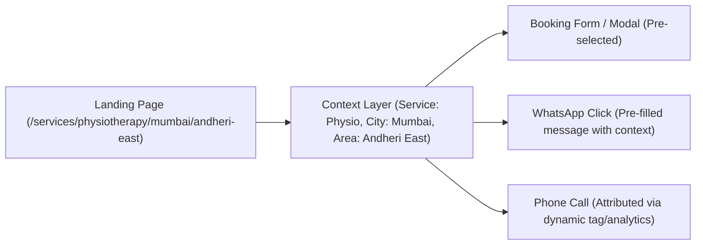
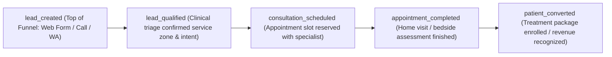

# CONVERSION_ATTRIBUTION_PLAN.md
## Conversion Context Preservation & Multi-Channel Attribution Specification

---

### 1. The Context Preservation Model (DEC-10)

When a patient arrives from Google on a high-intent page such as:
`/services/physiotherapy/mumbai/andheri-east`

They must never be forced to re-enter their City, Locality, or Service in the booking modal. The conversion funnel must automatically ingest this context:



---

### 2. Funnel Context Ingestion Architecture

#### 1. Pre-Populated Booking Form Props
```tsx
// Server component passes context directly to interactive client modal
<LeadEnquiryModal 
  initialContext={{
    serviceSlug: 'physiotherapy',
    serviceName: 'Physiotherapy',
    citySlug: 'mumbai',
    cityName: 'Mumbai',
    areaSlug: 'andheri-east',
    areaName: 'Andheri East',
    sourceUrl: canonicalUrl
  }}
/>
```

#### 2. Contextual WhatsApp Dynamic Link
Never present a generic `https://wa.me/919136447006`. Every WhatsApp button must dynamically generate a contextual greeting:
```typescript
export function buildContextualWhatsAppUrl(context: {
  service: string;
  city: string;
  area?: string;
  doctorName?: string;
}): string {
  const base = 'https://wa.me/919136447006';
  const text = context.doctorName 
    ? `Hello Aries PhysioCare, I would like to book a consultation with ${context.doctorName} in ${context.area || context.city}.`
    : `Hello Aries PhysioCare, I am looking for home ${context.service} in ${context.area ? `${context.area}, ${context.city}` : context.city}. Please share available slots.`;
  return `${base}?text=${encodeURIComponent(text)}`;
}
```

---

### 3. GA4, CRM & Google Ads Full Lifecycle Conversion Tracking

Do not stop at top-of-funnel `generate_lead`. Tracking must extend across the downstream patient lifecycle to ensure organic SEO is optimized for actual qualified patients and revenue, rather than cheap low-intent enquiries:



| Lifecycle Stage | Tracking Mechanism | Event Name | Custom Parameters & Context |
| :--- | :--- | :--- | :--- |
| **1. Initial Lead Captured** | Client/Server Action Form POST | `lead_created` (`generate_lead`) | `lead_id`, `service`, `city`, `area`, `gclid`, `landing_page` |
| **Phone Call Initiated** | `<a href="tel:...">` Click | `conversion_phone_call` | `phone_number`, `page_location`, `service`, `city`, `area` |
| **WhatsApp Chat Initiated** | `<a href="https://wa.me/...">` Click | `conversion_whatsapp_click` | `chat_destination`, `page_location`, `service`, `city`, `area` |
| **2. Lead Qualified** | CRM / Backend Webhook | `lead_qualified` | `lead_id`, `triage_status: "eligible"`, `service`, `city`, `area` |
| **3. Consultation Scheduled**| CRM / Booking System | `consultation_scheduled` | `lead_id`, `therapist_id`, `scheduled_time`, `session_type` |
| **4. Assessment Completed** | Specialist App Sync | `appointment_completed` | `lead_id`, `therapist_id`, `completion_status: "success"` |
| **5. Patient Converted** | Billing / Invoice Event | `patient_converted` (`purchase`) | `lead_id`, `transaction_id`, `package_value`, `currency: "INR"` |

---

### 4. Attribution Persistence (Fixing the `sessionStorage` Blindspot)
* **Problem**: In mobile browsers, navigating away to WhatsApp or initiating a phone call breaks single-page `sessionStorage`.
* **Solution**:
  1. Store UTM, GCLID, landing page URL, and entry timestamp in a **first-party HTTP-Only Cookie** (`_aries_attr`, lifetime 30 days) on initial server render via Next.js middleware.
  2. When an enquiry form is submitted via Server Action (`submitAppointmentLead`), read the cookie server-side and attach the immutable original landing page, referrer, and UTM data to the Firestore lead document.
  3. When downstream milestones (`lead_qualified`, `consultation_scheduled`, `patient_converted`) occur in CRM/Firestore, send Google Ads Enhanced Conversions / GA4 Measurement Protocol hits referencing the original `gclid` and landing context.
