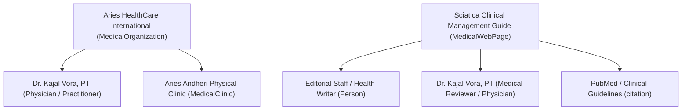

# HEALTHCARE_ENTITY_MODEL.md
## Healthcare E-E-A-T Entity Graph & Clinical Data Integrity Specification

---

### 1. The Core E-E-A-T Architecture (DEC-07)

Google Search Quality Raters evaluate health and wellness under strict **Your Money or Your Life (YMYL)** criteria. To prevent systemic algorithmic demotion, every clinical statement, condition guide, and practitioner profile must adhere to an explicit separation of entity roles:

---

### 2. Entity Role Definitions & Data Requirements

#### 1. Medical Organization (`MedicalOrganization`)
* **Legal Entity**: Aries HealthCare International Pvt Ltd.
* **Accreditations**: State Clinical Establishments Act registration, ISO compliance (where certified).
* **Transparency**: Clear executive leadership, physical headquarters address, registered medical director, transparent grievance mechanism, published patient charter.

#### 2. Practitioner (`Person` with Professional Occupation Semantics)
* **Schema.org Representation**: A physiotherapist is **not** automatically a `Physician` in the ordinary Schema.org definition (which denotes a medical doctor / MBBS). In structured data and knowledge graphs, physiotherapists must be modeled as `@type: "Person"` with `jobTitle`, `hasOccupation: { "@type": "Occupation", "name": "Physiotherapist" }`, and verified credentials.
* **Prohibition of Example / Mock Credentials**:
  > [!CAUTION]
  > **CRITICAL SAFETY GUARD**: Never use example credential data from architecture documents (such as *"MH-OTPT-1249"*) as placeholder or production data. Only authentic, council-verified credentials obtained from statutory state council databases may be published in markup or on page.
* **Mandatory Verified Fields in Database**:
  1. `legalName`: Exact name as registered with the statutory state council.
  2. `councilRegistrationNumber`: Authentic number verified against council registers.
  3. `stateCouncilOrBoard`: e.g., *"Maharashtra State Council for Occupational Therapy & Physiotherapy"*.
  4. `degrees`: Recognized university qualifications only (e.g., *"MPT (Neurology), BPT - MUHS"*). No proprietary or honorary titles without clinical legitimacy.
  5. `yearsOfClinicalExperience`: Integer calculated strictly from graduation / registration date.
  6. `verificationStatus`: `VERIFIED` | `PENDING` | `INACTIVE`. Only `VERIFIED` practitioners are indexable.
  7. `primaryWorkLocation`: Dedicated clinic or home dispatch zone.

#### 3. Medical Reviewer (`reviewedBy`)
* Educational / informational articles (`/conditions/*`) **cannot be self-reviewed by anonymous authors**.
* Every condition guide must display:
  * Written By: Content Specialist Name & Title.
  * Medically Reviewed By: Clinician Name, Credentials, Registration # (if verified), and Link to their `/physiotherapists/[slug]` profile.
  * Last Clinically Reviewed Date: **Dynamically maintained field sourced directly from content revision records in CMS/Firestore**. Never allow stale, hardcoded review dates.

#### 4. Clinical Evidence & Outbound Citations
* Condition pages and treatment modalities must cite authoritative medical sources (WHO, Cochrane Reviews, PubMed, Lancet, Indian Journal of Physiotherapy and Occupational Therapy).
* Citations must be rendered in semantic markup and referenced in Schema under `citation`.

---

### 3. Absolute Prohibitions (Zero-Tolerance Guardrails)
1. **Zero Fabricated Outcomes**: No statements claiming "100% cure rate", "guaranteed relief in 3 sessions", or "permanent reversal of disc bulge".
2. **No Fake Recovery Timelines**: Avoid prescriptive recovery claims without individualized clinical assessment disclaimers.
3. **No Fabricated Patient Reviews**: Reviews displayed in markup or on page must be verified from genuine authenticated feedback loops (or Google Business Profile API integration with verified review IDs).
4. **No Artificial Doctor Claims**: Never list a doctor as "Chief Orthopedic Surgeon" or similar medical title unless verified by license. Physiotherapists must be designated with appropriate professional post-nominals (e.g., `PT`, `BPT`, `MPT`).

---

### 4. Patient Safety & Tele-Health Disclaimers
Every medical condition and service landing page must include a standardized clinical disclaimer:

> **Medical Disclaimer**: *The information provided on this page is for educational purposes only and is not intended as a substitute for professional medical advice, diagnosis, or treatment. Always seek the advice of a qualified healthcare provider with any questions you may have regarding a medical condition. Aries PhysioCare home sessions are conducted exclusively following a comprehensive initial clinical assessment.*
